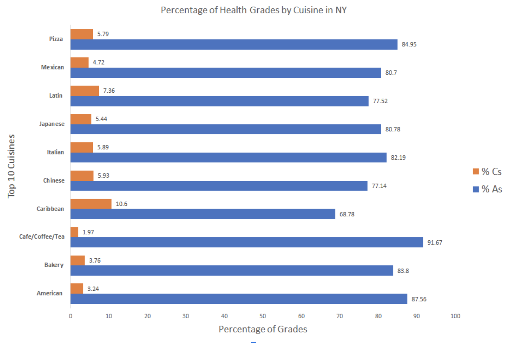

# Restaurant NYC: Siddharth Arun & Anil Kotte 

The restaurant industry is among the most competitive, with over a million restaurants across the United States. New York City boasts one of the most celebrated and diverse culinary locales, with world-renowned chefs such as Gordon Ramsay, Mario Batali, and Bobby Flay setting up shop. With over 26,000 restaurants in New York City, ranging from fast food to high-end luxury restaurants to mom-and-pop diners, NYC is the most exciting location to open the new, trendy restaurant. 

Our client is a restaurant entrepreneur who has approached us to analyze his next opening in New York City. He wants his restaurant to have a high health inspection rating with minimal code violations. Additionally he wants to know what type of cuisine his restaurant should features. The questions he would like us to address: 

1. What is the optimal location to open a high health-grade restaurant in New York City? 
2. What types of cuisines are least likely to fail health inspection? 

The key findings we have observed with our analysis: 

1. While the relationship between real estate prices and health code violations is statistically significant, there is tremendous variation between the number of health code violations within a specific zip-code. 
2. Our client can choose any zip code location for the restaurant, with cheaper rent options being more preferable. 
3. Cafe/Coffee shops have the highest proportion of A-grade and lowest proportion of C-grade among the top 10 cuisines analyzed. Additionally cafe/coffee shops are more popular among consumers, making it an attractive business option for our client. 

# Why is this a Challenge? 

What is the optimal location to open a high health-grade restaurant in New York City? What types of cuisines are least likely to fail health inspection? Not only is this problem important for budding restauranteurs, but also current restaurant owners in New York City. With any large metropolitan area, certain regions are more susceptible to inspections, whether it is due to socio-economic distribution or infrastructure. As a restaurant owner, it is important to understand the measures needed to maintain a high health grade for a restaurant, particularly if a certain region is more likely to be inspected by the government. 

The problem of health inspections faces a significant burden on restaurants in New York City, particularly those ventures who aim to circumvent inspections by presenting a "different face." There remains significant inconsistency for inspection ratings due to variation in the strictness of each inspector. Why is this grading important for a New York restaurant owner? By law in 2011, restaurants are obligated to post their health-grade clearly in the window, making it imperative for restaurants to achieve the coveted "A" grade. Even more, some aspects of the code, particularly that sinks need to be within 25 feet from a food prep area, preclude certain buildings from passing the health inspection - the old architecture of some NYC buildings forces a business into violations. Therefore, it is important to understand certain regions of NYC that have higher proportion of health code violations. 

Additionally, pricing and real estate play significant roles in a restauranteur's decision to start a new venture. On average, a restaurant in New York City ranges between 2000 to 5000 square feet, and as of June 2018, the average asking price for a spot in Manhattan and Brooklyn was ~ $120/square foot. Compared to analogous cities such as Los Angeles, with $52/sqft and San Francisco, with $45/sqft, New York City ranks among the toughest cities to break into the restaurant market. With such a volatile industry susceptible to high turnover and larger proportion of closings, it is important for restauranteurs to be cognizant of factors that could contribute to closings, namely those of health inspections, consumer grades, and real estate pricing. 

It is important to understand the implications of restaurant inspections and real estate pricing on a restauranteur's decision to open up shop in New York City. Certainly, this analysis can be applied to other decisions as well, namely that in the domestic real-estate market. Families looking to purchase a home in New York City want to look at health and safety of their building before they purchase - understanding the health & safety ratings of a particular region can help narrow places to live; additionally, pricing of a home is important for a family. Therefore, a better understanding of the average health rating and pricing in a certain zipcode can help families, perhaps real estate agents, determine properties to purchase or market, respectively. 

Sources: 
1. [New York Times Restaurant Expenses](https://www.nytimes.com/2016/10/26/dining/restaurant-economics-new-york.html)
2. [Elaborate Schemes to Survive Health Inspections](https://ny.eater.com/2019/6/28/18761345/department-of-health-letter-grades-nyc-restaurant-rules)

# Our Solution

Our final solution takes into account insights drawn from the regression run between real estate prices and restaurant health code violations along with analysis of average health code violations by cuisine. Our first suggestion to our client indicates the location to open a restaurant while maximizing probability of obtaining a passing health rating. From our analysis, we have discovered that the estimated coefficient between median zipcode real estate prices and number of health code violations is -0.22 and this variable was found to be statistically significant since its p-value is 0.0029 (which is smaller than 0.05).

__Results of Simple Linear Regression between Real Estate Prices and Health Code Violations__ 

| Coefficient        |Y-intercept          | P-value  | R2 Value |
| ------------- |:-------------:| -----:|-----:|
| -0.22      | 13.15 | 0.0029 | 0.000183 |

The interpretation of this coefficient is that as the median zipcode real estate price increases by $1 million then the average number of health code violations for a restaurant decrease by 0.22. From a purely statistical view it seems that setting up a restaurant in the most expensive zip code area would produce the highest health rating. However, considering that the most expensive real estate zip code area in New York City has a median listing of $3 million and the cheapest zip code area is approximately $120,000 then the difference between opening a restaurant in the cheapest and most expensive zip code location is approx. 0.66 health code violations. Because the amount of health code violations needed to get an A rating is between 0 to 14, then it is unlikely than a decrease of 0.66 would have a significant impact on the final score a restaurant receives. Because we should never purely on data and statistics to make business decisions, we recommend that our client not worry about the opening zip code location since it doesn’t have a sizable impact on restaurant health violations. In fact, our client can save a lot of money by opening up in a cheaper area and having a similar average health code rating. 

__Proportion of A-grade (high-rank) and C-grade (low-rank) by Cuisine__

| Cuisine        | % A-grade           | % C-grade  |
| ------------- |:-------------:| -----:|
| American      | 87.56 | 3.24 |
| Bakery      | 83.8      |   3.76 |
| Cafe/Coffee | 91.67     |    1.97 |
| Caribbean      | 68.78| 10.6 |
| Chinese      | 77.14      |   5.93 |
| Italian | 82.19     |    5.89 |
| Japanese      | 80.78 | 5.44 |
| Latin      | 77.52      |   7.36 |
| Mexican | 80.7      |    4.72 |
| Pizza | 84.95      |    5.79 |

Lastly, we recommend that our client open a coffee shop because on average they have the lowest average health code violation, highest proportions of A ratings, and lowest proportion of C ratings. Intuitively this makes sense since coffee shops often don't have kitchens and use relatively simple procedures to prepare their product. In addition, because we limited our analysis to only the top 10 popular cuisines in NYC we can ensure that these cuisines will be in high demand due to their popularity and avoid being too niche.  

< figure >

</figure> 

# Future Suggestions 

As mentioned prior, we recommend that our client opens a cafe/coffee shop in a zip code with traditionally lower rent pricing. What does this mean for our client? We foresee a significant opportunity to break into the cafe space - while this market is particularly saturated in NYC, opening in an area of lower rent can decrease potential costs for our client. Traditionally, maintenance costs for cafes are significantly lower than that of other cuisines, rendering it a much more attractive opportunity for our client to promote revenue. 

Looking at the data presented, we also realize the opportunity to improve the quality of Caribbean and Chinese restaurants, both of whom have significantly less proportion of A-grades compared to cafe/coffee shops. This can aid restauranteurs in determining which cuisines require more maintenance & inspection 

# Appendix 

## Our datasets: 
1. [New York City Health Inspection Data (2016-2019)](https://data.cityofnewyork.us/Health/DOHMH-New-York-City-Restaurant-Inspection-Results/43nn-pn8j)
2. [Zillow New York City Real Estate Data (2019)](https://www.zillow.com/new-york-ny/home-values/)

